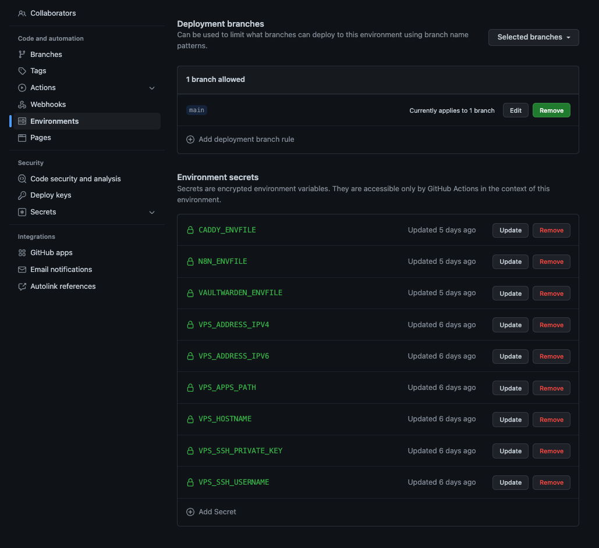

# Installation steps

This docker-compose is intendeed to serve a sample about how to have autodeploy on your own vps that is made when you commit changes to branch `main` of this repository.

Currently run services:
- [Vaultwarden](https://github.com/dani-garcia/vaultwarden)
- [n8n](https://n8n.io)



## Prerequisites

Setup VPS server with Docker, OpenSSH configured and asymetric rsa generated with:

```bash
ssh-keygen -t rsa -b 4096 -C <your.email.adress@example.com>
```

The private key should be set in `VPS_SSH_PRIVATE_KEY`.

**NOTE** You can generate these keys in your computer and later the content of the public must be in a new line in the `${HOME}/.ssh/authorized_keys2` in the user that will be used for deploy in your VPS. **DO NOT DEPLOY AS ROOT**

Is a good idea has a group that can connect through ssh and add the users that can connect to that group.

## Env vars

You need to define enviromental variables in `production` [environment](settings/environments/new) of your github repository with the envfiles in `CADDY_ENVFILE`, `VAULTWARDEN_ENVFILE` and `N8N_ENVFILE` and the `.env` files will be created on the server when deploy.

You should configure as well the SSH options to connect to your VPS that are showed in the screenshot on top.


## Create a docker user

`<ssh_group>` should be created by you if you want to setup recommended way with a custom ssh group of users that can connect via ssh.

```bash
adduser deploy-user
usermod -aG deploy-user,docker,<ssh_group>
```


## Firewall Rules

```bash
sudo apt install -y ufw iptables-persistent
ufw allow ssh
ufw allow 80/tcp
ufw allow 443/tcp
```

### Saving the rules

```bash
ip6tables-save | sudo tee /etc/iptables/rules.v6
iptables-save | sudo tee /etc/iptables/rules.v4
```

## Perform a backup

```bash
./scripts/docker-compose-backup.sh \
  --project-name vps-apps \
  --volume-name vaultwarden \
  --volume-path "/data" \
  --backup-path "./backups" \
  --backup-prefix "vaultwarden" \
  --image alpine:latest
```

It will create file in `./backups` with the name `backup-2022-08-26-03-15-31-vps-apps_vaultwarden.tar.bz2`. I use bz2 but you can switch to other tool by changing command in line [134 of `./scripts/docker-compose-backup.sh`](blob/HEAD/scripts/docker-compose-backup.sh#L134)

See more help:

```bash
./scripts/docker-compose-backup.sh --help
```

## Setup a crontab

```bash
./scripts/setup-crontab.sh 0 */12 * * * '${HOME}/vps-apps/scripts/docker-compose-backup.sh --project-name vps-apps --volume-name vaultwarden --volume-path "/data" --backup-path "/backup" --backup-prefix "vaultwarden" --image alpine:latest'
```

See more help:

```bash
./scripts/setup-crontab.sh --help
```

## Restoration a backup

Coming soon...

## Migrating volumes

Documentation & script is coming soon but you can check [`copy-docker-volume-compose.sh`](blob/HEAD/scripts/copy-docker-volume-compose.sh) with an example I used to migrate from my previous vaultwarden volume.


## TODO

- [x] Scripts to make a backup
- [ ] Script to restore a backup
- [-] Automate backups (Must be set manually)
- [ ] More generic github action to automatically use `*_ENVFILES` files and create them in server.
- [ ] Add testing for `docker-compose.yaml` in pre commit.


## Contributing

PR's are very welcome


## Interesting readings

- https://docs.docker.com/engine/install/
- https://docs.docker.com/network/iptables/
- https://docs.n8n.io/hosting/environment-variables/
- https://github.com/dani-garcia/vaultwarden/wiki/Using-Docker-Compose

